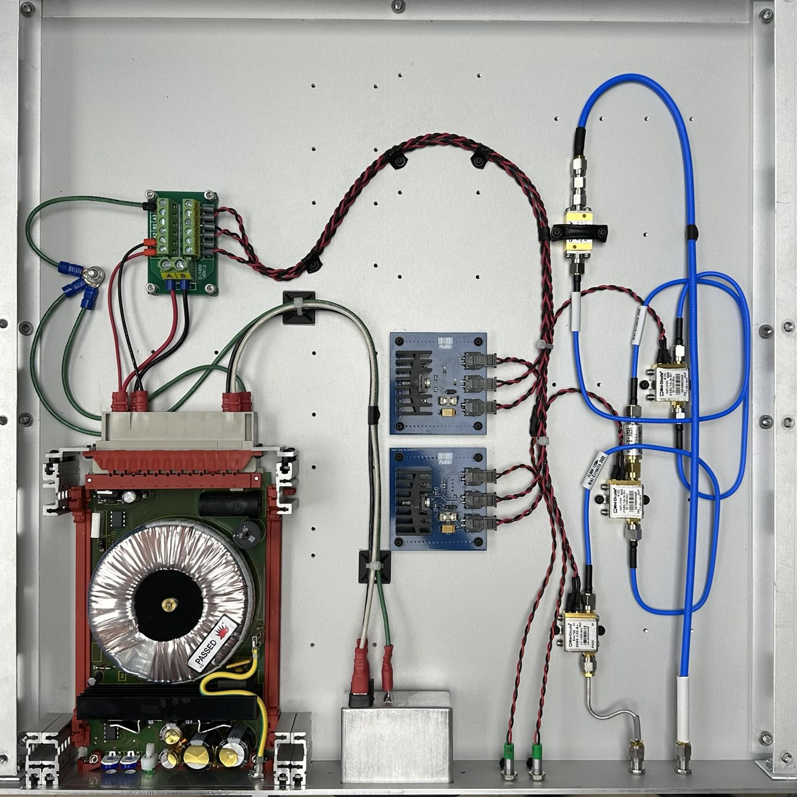

### Second-Stage Enclosure
This Enclosure is designed to house second and third-stage Mini-Circuits ZX60-14LN-S+ Amplifiers, Equalizers (Slope Compensators), a Bias-Tee, Linear Voltage Regulators, and a Linear Power Supply.

The custom front and bottom plates where manufactured by Font Panel Express (see Directory for fpd files)

In the current configuration the input sma connector will supply a 12V bias to the Fist Stage.

