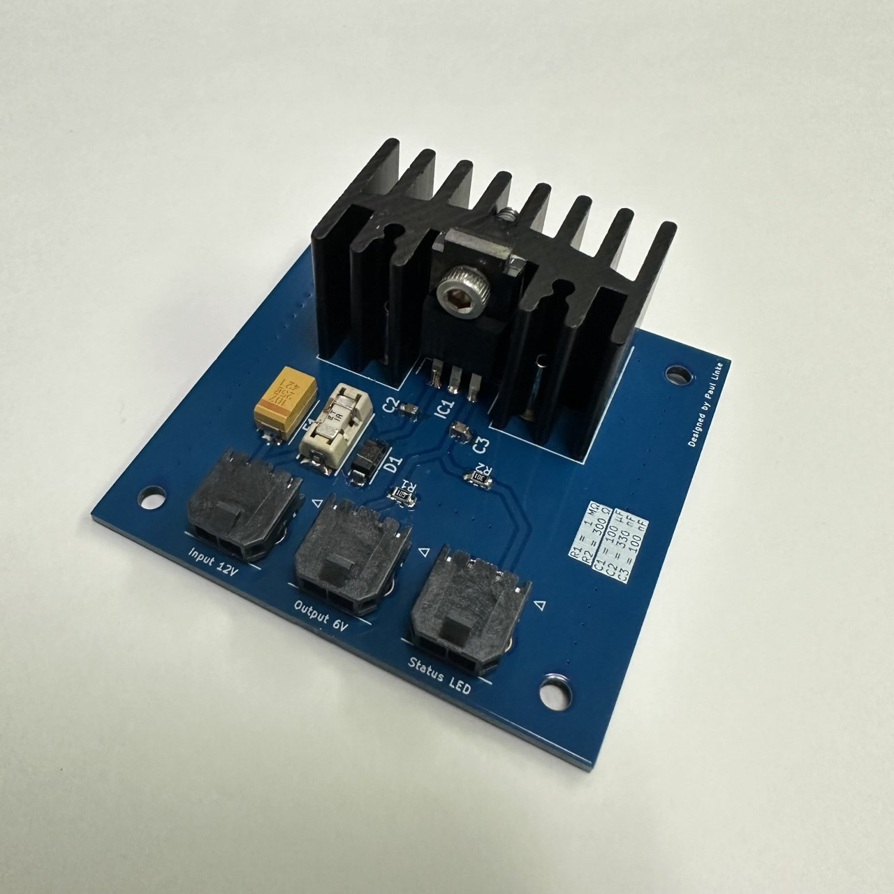
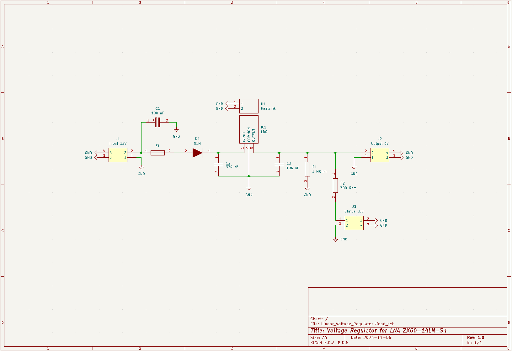

### Linear Voltage Regulator for the Mini-Circuits ZX60-14LN-S+ Amplifier

This Regulator PCB will take an input Voltage of 8.5V to 21V and step it down to a stable 6V. 

The maximum Output Current is 1A.

The Device was designed in KiCAD 8.0.6, all necessary design files can be found in this directory.

Note: As of this Version the polarity of the Status LED is flipped, please take care when wiring. 

